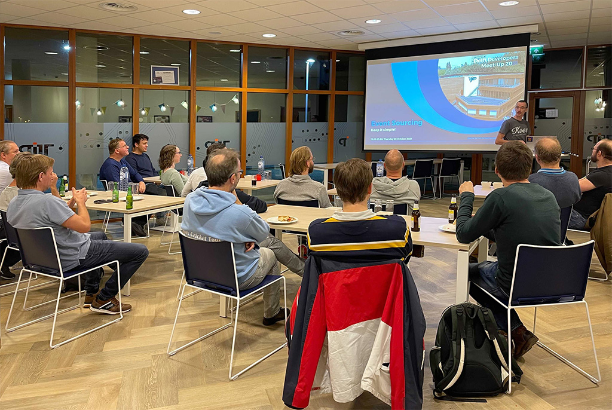

# Event Sourcing
## Keep it simple!

During the [Delft Developers Meetup Event](https://www.meetup.com/delft-developers-group/events/281520687/)
of 28th October 2021, I was offered the opportunity to speak about Event
Sourcing. Thanks to [TJIP](https://tjip.com) for organizing this.

The short version of the story:
Focus on writing your Domain Models, be expressive, and keep both events and
replay methods as simple as possible, ideally without if-statements and other
logic.

 To illustrate the story, I showed this [Conquer Club show case](https://github.com/Qowaiv/qowaiv-domainmodel/tree/master/example).
 For those interested, the slides are [on-line](2021-10-28_event_sourcing-keep_it_simple.odp).
 