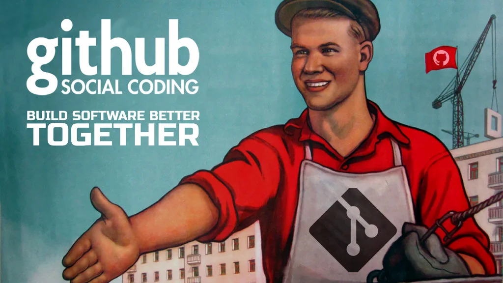

# Social Coding
## What we can learn from the open source community

It was about ten years ago that the lessons learned from the
[Manifesto for Agile Software Development](https://agilemanifesto.org/)
where - in some form - adopted by the company I was working for; we started to
work in _sprints_, and arranged work in _epics_, _stories_, and _work items_.

A great improvement in the way of working - although the almost religious
adoption by some was counterproductive. At the other side of the spectrum, some
could not really let go the good old waterfall; Stories themselves were (small)
waterfalls, leaving no room for discussion, and new insights while coding.

However, the creation of a pull request has been treated - by most - as the
final step in the process, not as the starting point of the cooperation - both
within and outside the team. And that's a pity. Not only because the
contributor might have to redo all his/her work because the reviewer does not
approve with the approach, but it also makes it harder for others to come up
with suggestions. On top of that, for a reviewer it can be overwhelming to be
confronted with a zillion code changes at once.

The alternative way of working is called [social coding](https://opentechschool.github.io/social-coding/)
and is highly adopted by the open source community, and is the fundamental
to the way [GitHub](https://github.org) works. A (draft) pull request is there
the starting point of the discussion/change, followed by multiple iterations
reviewed and discussed by (multiple) reviewer(s) and (co) contributer(s).

To make this work with a company, by default (sometimes there are legal
limitations), all developers/tests should have read access to all source code.
Reviewers should not be limited to team that is responsible for the code base -
for simple bug fixes, you might not want to bother other teams though - and
ideally, multiple reviewers are involved.

### Further reading
[IBM blog](https://www.ibm.com/garage/method/practices/culture/practice_social_coding/)

